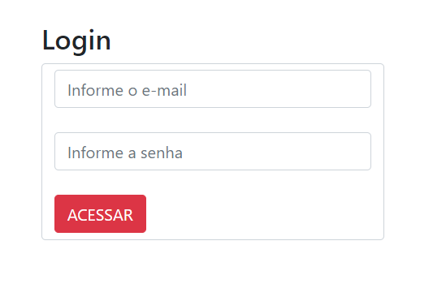
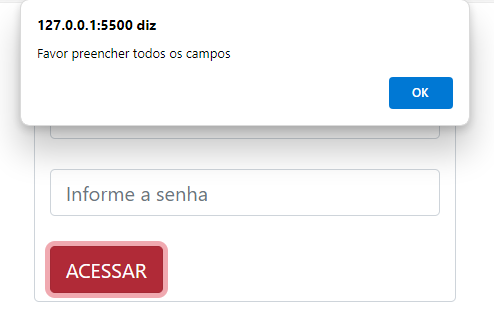
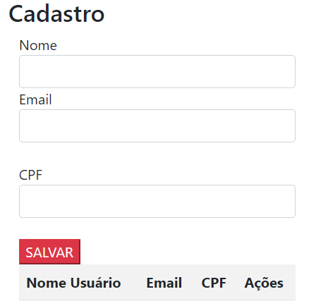
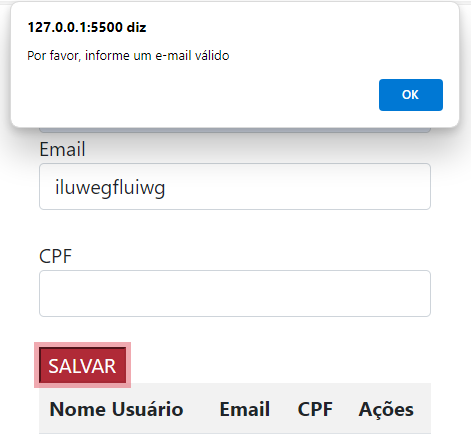
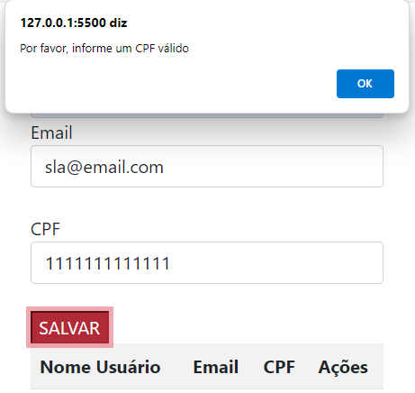

# LOGIN CAD 
 
## LOGIN
### OBJETIVO DO PROJETO 
O objetivo deste projeto é permitir que os usuários realizem o login em um sistema. Para isso, os usuários devem preencher corretamente os campos obrigatórios.
 
 
* O usuário deve preencher todos os campos obrigatórios corretamente.
* O sistema realizará a validação dos campos. Caso algum campo esteja incorreto ou não preenchido, um alerta será exibido para informar o usuário.
 
  
 
 
## CADASTRO 
Após um login bem-sucedido, o usuário será direcionado para a página de cadastro, onde poderá adicionar informações sobre membros.
* Na página de cadastro, o usuário poderá adicionar nomes à lista, salvar as informações, e terá as opções de editar ou excluir os dados conforme necessário.  

# Implementação da Tabela de E-mail 
 
## Objetivo 
Garantir que os usuários forneçam um endereço de e-mail válido ao se registrar ou atualizar suas informações.
 
## Funcionamento
*  O sistema vai verifica se o e-mail inserido contém pelo menos um caractere "@" e um ponto ".".
*  Se o e-mail não apresentar as caracteres, um alerta é exibido ao usuário para corrigir o e-mail.
## Exemplo de Validação: 
* E-mail Válido: exemplo@um.com
* E-mail Inválido: exemplo@dois (falta o ponto) ou exemplotrês.com (falta o @) 
 
# Implementação da Tabela de CPF
 
## Objetivo e funcionamento
Os objetivos e funcionamentos do CPF são semelhantes ao do E-mail, o código ira verificar se o CPF é válido.
* Verifica se o número de CPF inserido é válido e segue o padrão brasileiro, ajudando a evitar erros de digitação e fraudes. Cada CPF deve ter 11 dígitos e passar por um cálculo específico para confirmar sua autenticidade.

 
 
 # ELEMENTOS UTILIZADOS NO PROJETO 
## FUNÇÃO ACESSAR
*  Validar se os campos de email e senha estão preenchidos antes de redirecionar o usuário para uma nova página.
    document.getElementById: recupera o valor do campo
    alert: aparecerá um alerta para o usuário
 ## FUNÇÃO SALVAR USER
 *  Adicionar um nome à lista de usuários e atualizar a visualização da lista.
    dadosLista.push(nomeUser): adiciona um nome à lista
    criaLista(): atualiza a visão da lista
 ## FUNÇÃO CRIAR LISTA
* Criar e atualizar a tabela de usuários com os nomes armazenados na lista.
       document.getElementById("tabela").innerHTM: Define o HTML da tabela.
       dadosLista[i]: acessa o nome a posição (i) da tabela.
## FUNÇÃO EDITAR
 * Permitir a edição de um nome da lista
document.getElementById("nomeUser").value = dadosLista[(i - 1)]: Preenche o campo de nome com o valor selecionado para edição.
dadosLista.splice(i - 1, 1): para remover o item
 ## FUNÇÃO EXCLUIR
 * Excluir um nome da lista e atualizar a tabela.
dadosLista.splice((i - 1), 1): Remove o nome da lista na posição i - 1.
document.getElementById("tabela").deleteRow(i): Remove a linha da tabela na posição i.
## FUNÇÃO VALIDAR EMAIL
       document.forms[0].email.value.indexOf("@") == -1 ||: para verificar se tem o "@" no email
       document.forms[0].email.value.indexOf(".") == -1: para verificar se tem o "." no email

### Autores
* Maria Yanagui
* Ricardo Siena